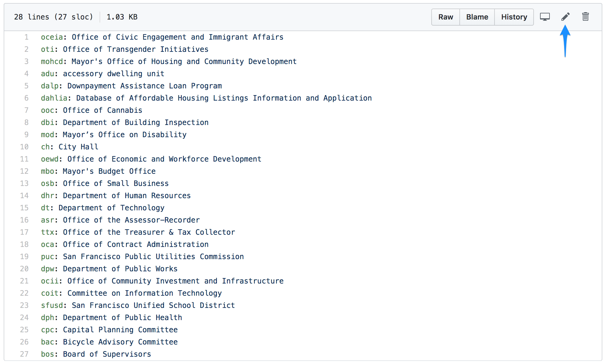
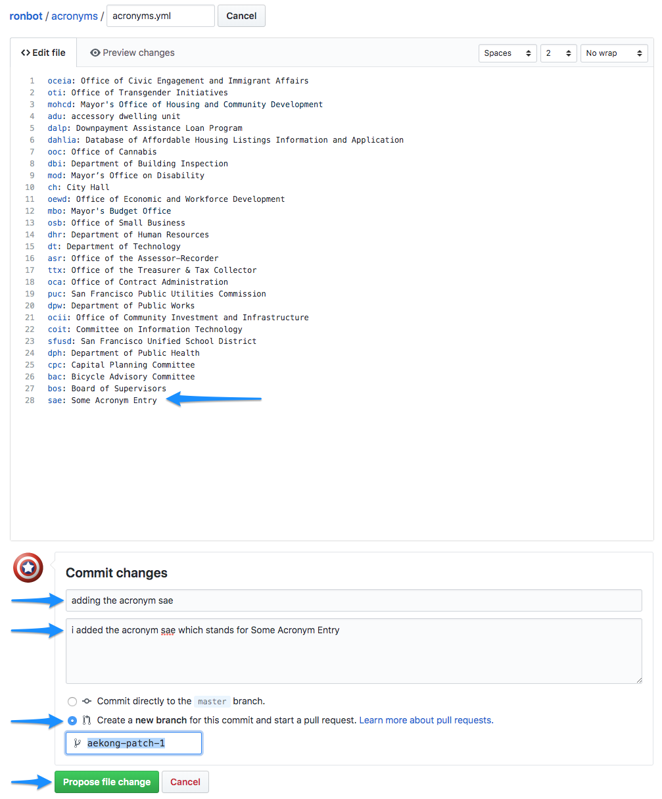
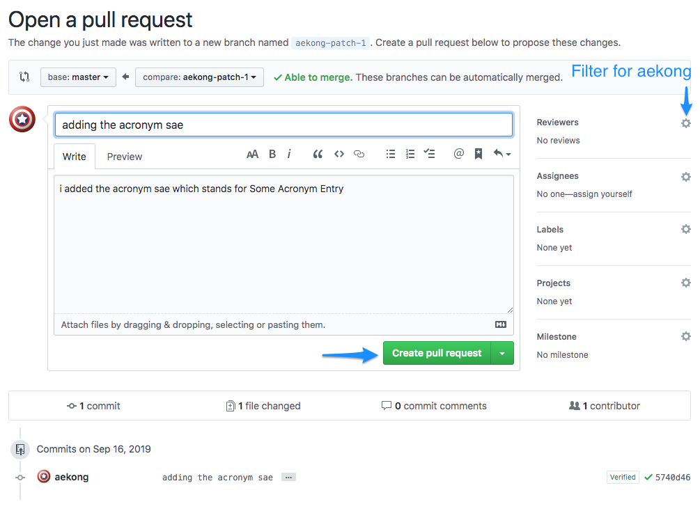

# Adding an acronym
Sign up for a github account here: [https://github.com/join](https://github.com/join)

A pull request (a request to modify the contents of this repository) will need to be created to update the acronyms file that ronbot reads.  This is a three step process.

## Step 1 - Browse to the file that needs to be updated
In a browser, navigate to [https://github.com/SFDigitalServices/ronbot/blob/master/acronyms/acronyms.yml](https://github.com/SFDigitalServices/ronbot/blob/master/acronyms/acronyms.yml).  Click the pencil to update this file via the browser:



## Step 2 - Add the acronym entry
Acronyms must be added in a specific format:

```
key: value
```

For example, if to add the acronym `sae` which stands for `Some Acronym Entry`, add this to the end of the `acronyms.yml` file:

```
sae: Some Acronym Entry
```

Fill out the other fields if more context needs to be given.

**Important**: Be sure to click the radio button labeled "Create a **new branch** for this commit and start a pull request"

When finished, click the "Propose file change" button.



## Step 3
Add aekong as the reviewer and click the "Create pull request" button.  This will put the newly added acronym in a review state.  Once approved, ronbot will understand the new acronym.

